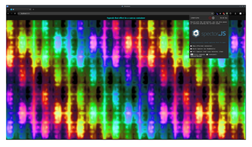

## beamterm - A WebGL2 Terminal Renderer

[![Crate Badge]][Crate] [![NPM Badge]][NPM] [![API Badge]][API] [![Deps.rs
Badge]][Deps.rs] 

A high-performance terminal rendering system for web browsers, targeting sub-millisecond render 
times. **beamterm** is a terminal renderer, not a full terminal emulator - it handles the display
layer while you provide the terminal logic.

Completely new to beamterm? Have a look at the [live demos][demos], showcasing both pure Rust
applications and JavaScript/TypeScript examples.

## Key Features

- **Single Draw Call** - Renders entire terminal (e.g., 200×80 cells) in one instanced draw
- **Zero-Copy Updates** - Direct memory mapping for dynamic cell updates
- **Unicode and Emoji Support** - Complete Unicode support with grapheme clustering
- **ASCII Fast Path** - Direct bit operations for ASCII characters (no lookups)
- **Optional JS/TS Bindings** - Provides a [JavaScript/TypeScript API](js/README.md) for easy integration


## Performance

beamterm targets sub-millisecond render times across a wide range of hardware:

| Metric                          | Target (Low-end) | Achieved (2019 hardware) |
|---------------------------------|------------------|--------------------------|
| Render Time†                    | <1ms @ 16k cells | <1ms @ 45k cells         |
| Draw Calls                      | 1 per frame      | 1 per frame              |
| Memory Usage                    | ~2.8MB           | ~2.8MB                   |
| Update Bandwidth (full refresh) | ~8 MB/s @ 60 FPS | ~22 MB/s @ 60 FPS        |

[](images/ratzilla_canvas_waves_426x106.png)

The screenshot shows [Ratzilla's][rz] "canvas waves" demo running in a 426×106 terminal (45,156 cells),
maintaining sub-millisecond render times on 2019-era hardware (i9-9900K / RTX 2070).

† *Includes Ratatui buffer translation, GPU buffer uploads, and draw call execution.*

 [rz]: https://github.com/orhun/ratzilla


## System Architecture

The renderer consists of three crates:

**`beamterm-atlas`** - Generates GPU-optimized font atlases from TTF/OTF files. Automatically 
calculates cell dimensions, supports font styles (normal/bold/italic), and outputs packed
texture data.

**`beamterm-data`** - Provides shared data structures and efficient binary serialization. Features
versioned format with header validation and cross-platform encoding.

**`beamterm-renderer`** - The WebGL2 rendering engine. Implements instanced rendering with optimized
buffer management and state tracking for consistent sub-millisecond performance.


## Architecture Overview

The architecture leverages GPU instancing to reuse a single quad geometry across all terminal cells,
with per-instance data providing position, character, and color information. All rendering state is
encapsulated in a Vertex Array Object (VAO), enabling single-draw-call rendering with minimal CPU
overhead. The 2D texture array maximizes cache efficiency by packing related glyphs into horizontal
strips within each layer.

### Buffer Management Strategy

The renderer employs several optimization strategies:

1. **VAO Encapsulation**: All vertex state is captured in a single VAO, minimizing state changes
2. **Separate Static/Dynamic**: Geometry and positions rarely change; only cell content is dynamic
3. **Aligned Packing**: All structures use explicit alignment for optimal GPU access
4. **Batch Updates**: Cell updates are batched and uploaded in a single operation
5. **Immutable Storage**: 2D texture array uses `texStorage3D` for driver optimization hints

These strategies combined enable the renderer to achieve consistent sub-millisecond frame times even
for large terminals (200×80 cells = 16,000 instances).

### Total Memory Requirements

For a 200×80 terminal with 2560 glyphs:

| Component      | Size        | Type                        |
|----------------|-------------|-----------------------------|
| Font Atlas     | 2.73 MB     | Texture memory              |
| Static Buffers | ~63 KB      | Vertex + Instance positions |
| Dynamic Buffer | ~125 KB     | Cell content                |
| Overhead       | ~10 KB      | VAO, shaders, uniforms      |
| **Total**      | **~2.9 MB** | GPU memory                  |


## Terminal Renderer API

The renderer provides a high-level `Terminal` struct that encapsulates the complete rendering system:

### Quick Start

```rust
use beamterm_renderer::{Terminal, CellData, FontStyle, GlyphEffect};

// Create terminal with default font atlas
let mut terminal = Terminal::builder("#canvas").build()?;

// Update cells and render
let cells: Vec<CellData> = ...;
terminal.update_cells(cells.into_iter())?;
terminal.render_frame()?;

// Handle resize
terminal.resize(new_width, new_height)?;
```

### TerminalGrid
Main rendering component managing the terminal display. Handles shader programs, cell data, GPU
buffers, and rendering state. Key methods include `new()` for initialization, `update_cells()`
for content updates, and sizing queries.

### FontAtlas
Manages the 2D texture array containing all font glyphs. Provides character-to-glyph ID
mapping with fast ASCII optimization. Supports loading default or custom font atlases.


### Cell Data Structure

Each terminal cell requires:
- **symbol**: Character or grapheme to display (`&str`)
- **style**: `FontStyle` enum (Normal, Bold, Italic, BoldItalic)
- **effect**: `GlyphEffect` enum (None, Underline, Strikethrough)
- **fg/bg**: Colors as 32-bit ARGB values (`0xAARRGGBB`)

## Font Atlas 2D Texture Array Architecture

The font atlas uses a WebGL 2D texture array where each layer contains a 16×1 grid of glyphs (16 
per layer). This provides optimal memory utilization and cache efficiency while maintaining O(1) 
coordinate lookups through simple bit operations. The system supports 512 base glyphs × 4 styles + 
emoji.

### 2D Texture Array Coordinate System

The font atlas uses a 2D texture array organized as multiple layers, each containing a 16×1 grid 
of glyphs:

| Dimension  | Size        | Formula            | Description             |
|------------|-------------|--------------------|-------------------------|
| **Width**  | Cell × 16   | 12 × 16 = 192px    | 16 glyphs horizontally  |
| **Height** | Cell × 1    | 18 × 1 = 18px      | 1 glyph vertically      |
| **Layers** | ⌈Glyphs/16⌉ | max(glyph.id) / 16 | One layer per 16 glyphs |

The layers are densely packed, but there might be gaps beween font variants
and before the first emoji layer, unless all 512 glyphs are used.

### Glyph ID Encoding and Mapping

The glyph ID is a 16-bit value that efficiently packs both the base glyph identifier
and style information (such as weight, style flags, etc.) into a single value. This
packed representation is passed directly to the GPU.

### Glyph ID Bit Layout (16-bit)

| Bit(s) | Flag Name     | Hex Mask | Binary Mask           | Description               |
|--------|---------------|----------|-----------------------|---------------------------|
| 0-8    | GLYPH_ID      | `0x01FF` | `0000_0001_1111_1111` | Base glyph identifier     |
| 9      | BOLD          | `0x0200` | `0000_0010_0000_0000` | Bold font style           |
| 10     | ITALIC        | `0x0400` | `0000_0100_0000_0000` | Italic font style         |
| 11     | EMOJI         | `0x0800` | `0000_1000_0000_0000` | Emoji character flag      |
| 12     | UNDERLINE     | `0x1000` | `0001_0000_0000_0000` | Underline effect          |
| 13     | STRIKETHROUGH | `0x2000` | `0010_0000_0000_0000` | Strikethrough effect      |
| 14-15  | RESERVED      | `0xC000` | `1100_0000_0000_0000` | Reserved for future use   |

#### ID to 2D Array Position Examples

| Character | Style       | Glyph ID | Calculation            | Result                | 
|-----------|-------------|----------|------------------------|-----------------------|
| ' ' (32)  | Normal      | 0x0020   | 32÷16=2, 32%16=0       | Layer 2, Position 0   |
| 'A' (65)  | Normal      | 0x0041   | 65÷16=4, 65%16=1       | Layer 4, Position 1   |
| 'A' (65)  | Bold+Italic | 0x0641   | 1601÷16=100, 1601%16=1 | Layer 100, Position 1 |
| '€'       | Normal      | 0x0080   | Mapped to ID 128       | Layer 8, Position 0   |
| '🚀'      | Emoji       | 0x0881   | With emoji bit set     | Layer 136, Position 1 |

The consistent modular arithmetic ensures that style variants maintain the same horizontal position
within their respective layers, improving texture cache coherence.

### ASCII Optimization

ASCII characters (0-127) bypass the HashMap lookup entirely through direct bit manipulation.
For ASCII input, the glyph ID is computed as `char_code | style_bits`, providing zero-overhead
character mapping. Non-ASCII characters use a HashMap for flexible Unicode support. This approach
optimizes for the common case while maintaining full Unicode capability.

## GPU Buffer Architecture

The renderer uses five buffers managed through a Vertex Array Object (VAO) to achieve
single-draw-call rendering. Each buffer serves a specific purpose in the instanced
rendering pipeline, with careful attention to memory alignment and update patterns.

### Buffer Layout Summary

| Buffer                | Type | Size         | Usage          | Update Freq | Purpose           |
|-----------------------|------|--------------|----------------|-------------|-------------------|
| **Vertex**            | VBO  | 64 bytes     | `STATIC_DRAW`  | Never       | Quad geometry     |
| **Index**             | IBO  | 6 bytes      | `STATIC_DRAW`  | Never       | Triangle indices  |
| **Instance Position** | VBO  | 4 bytes/cell | `STATIC_DRAW`  | On resize   | Grid coordinates  |
| **Instance Cell**     | VBO  | 8 bytes/cell | `DYNAMIC_DRAW` | Per frame   | Glyph ID + colors |
| **Vertex UBO**        | UBO  | 80 bytes     | `STATIC_DRAW`  | On resize   | Projection matrix |
| **Fragment UBO**      | UBO  | 32 bytes     | `STATIC_DRAW`  | On resize   | Cell metadata     |

All vertex buffers are encapsulated within a single Vertex Array Object (VAO), enabling state-free
rendering with a single draw call.

The **Instance Position** and **Instance Cell** buffers are recreated when the terminal size changes,

### Vertex Attribute Bindings

| Location | Attribute   | Type    | Components       | Divisor | Source Buffer     |
|----------|-------------|---------|------------------|---------|-------------------|
| 0        | Position    | `vec2`  | x, y             | 0       | Vertex            |
| 1        | TexCoord    | `vec2`  | u, v             | 0       | Vertex            |
| 2        | InstancePos | `uvec2` | grid_x, grid_y   | 1       | Instance Position |
| 3        | PackedData  | `uvec2` | glyph_id, colors | 1       | Instance Cell     |

### Instance Data Packing

The 8-byte `CellDynamic` structure is tightly packed to minimize bandwidth:

```
Byte Layout: [0][1][2][3][4][5][6][7]
              └┬─┘  └──┬──┘  └──┬──┘
           Glyph ID  FG RGB   BG RGB
           (16-bit) (24-bit) (24-bit)
```

This layout enables the GPU to fetch all cell data in a single 64-bit read, with the glyph
ID encoding both the texture coordinate and style information as described in the [Glyph ID Bit
Layout](#glyph-id-bit-layout-16-bit) section.

### Memory Layout and Performance

For a typical 12×18 pixel font with 2560 glyphs:

| Component            | Size      | Details                                    |
|----------------------|-----------|--------------------------------------------|
| **2D Texture Array** | ~2.73 MB  | 16(12+2)×(18+2)×128 RGBA (16 glyphs/layer) |
| **Vertex Buffers**   | ~200 KB   | For 200×80 terminal                        |
| **Cache Efficiency** | Good      | Sequential glyphs in same layer            |
| **Memory Access**    | Coalesced | 64-bit aligned instance data               |

The 16×1 grid layout ensures that adjacent terminal cells often access the same texture layer,
maximizing GPU cache hits. ASCII characters (the most common) are packed into the first 8 layers,
providing optimal memory locality for typical terminal content.

### Shader Pipeline

The renderer uses a branchless shader pipeline optimized for instanced rendering:

#### Vertex Shader (`cell.vert`)
Transforms cell geometry from grid space to screen space using per-instance attributes. The shader:

- Calculates cell position by multiplying grid coordinates with cell size
- Applies orthographic projection for pixel-perfect rendering
- Passes packed instance data directly to fragment shader without unpacking

#### Fragment Shader (`cell.frag`)
Performs the core rendering logic with efficient 2D array texture lookups:

- Extracts 16-bit glyph ID from packed instance data
- Masks with 0x0FFF to exclude effect flags before computing layer index (glyph_id → layer/position)
- Computes layer index and horizontal position using bit operations
- Samples from 2D texture array using direct layer indexing
- Detects emoji glyphs via bit 11 for special color handling
- Applies underline/strikethrough effects via bits 12-13
- Blends foreground/background colors with glyph alpha for anti-aliasing


### WebGL2 Feature Dependencies

The renderer requires WebGL2 for:
- **2D Texture Arrays** (`TEXTURE_2D_ARRAY`, `texStorage3D`, `texSubImage3D`)
- **Instanced Rendering** (`drawElementsInstanced`, `vertexAttribDivisor`)
- **Advanced Buffers** (`UNIFORM_BUFFER`, `vertexAttribIPointer`)
- **Vertex Array Objects** (`createVertexArray`)

## Build and Deployment

### Development Setup
```bash
# Install Rust toolchain
curl --proto '=https' --tlsv1.2 -sSf https://sh.rustup.rs | sh
rustup target add wasm32-unknown-unknown

# Install tools
cargo install wasm-pack trunk

# Development server
trunk serve

# Production build
trunk build --release
```

## Design Decisions

### Why 16×1 Grid Per Layer?

- **GPU compatibility**: Single-row layout maximizes horizontal cache coherence and minimizes 
texture sampling overhead
- **Simplified math**: Position within layer is just a matter of `glyph_id & 0x0F`
- **Cache efficiency**: Sequential glyphs (e.g., ASCII characters) are horizontally contiguous, 
improving texture cache hit rates

### Why Separate Style Encoding?

- Avoids duplicating glyph definitions
- Enables runtime style switching without texture lookups
- Maintains consistent coordinates for style variants

## Limitations

- Maximum 512 base glyphs (9-bit addressing)
- Fixed 4 style variants per glyph
- Monospace fonts only
- Single font family and font size per atlas


## TODO
- [x] **Text Effects**: Underline, strikethrough
- [x] **Font Variants**: Bold, italic, and other font weight support
- [x] **Complete Glyph Set**: Report (e.g. via logging) when glyphs are missing from the atlas
- [x] **Emoji support**: Currently renders with only the foreground color

## Undecided|Lower Prio Features
- [ ] **Double Buffering**: Are there any benefits to double buffering for terminal rendering?
- [ ] **Dynamic Atlases**: Runtime glyph addition without regeneration
- [ ] **Partial Updates**: Only update changed cells instead of full grid
- [ ] **Context Loss Recovery**: Buffer architecture designed for WebGL context restoration

[API Badge]: https://docs.rs/beamterm-renderer/badge.svg
[API]: https://docs.rs/beamterm-renderer
[Crate Badge]: https://img.shields.io/crates/v/beamterm-renderer.svg
[Crate]: https://crates.io/crates/beamterm-renderer
[Deps.rs Badge]: https://deps.rs/repo/github/junkdog/beamterm-renderer/status.svg
[Deps.rs]: https://deps.rs/repo/github/junkdog/beamterm-renderer
[demos]: https://junkdog.github.io/beamterm/
[npm]: https://www.npmjs.com/package/@beamterm/renderer
[NPM Badge]: https://img.shields.io/npm/v/@beamterm/renderer.svg
